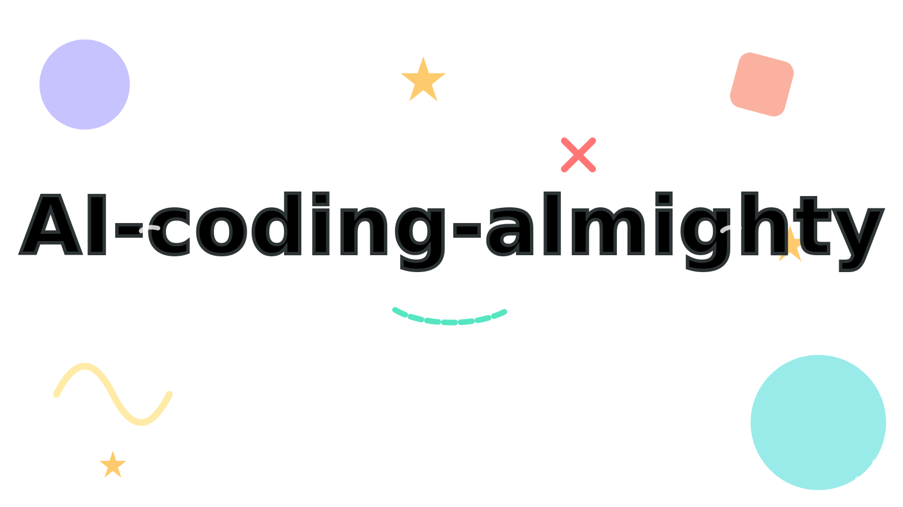

# Turn AI Agents into Your Development Team



> Build Claude Code into a complete AI development team through carefully designed Skills and MCP servers, covering the full lifecycle from requirements analysis and architecture design to UI design, frontend/backend development, and testing.

## 📋 Table of Contents

- [Project Overview](#project-overview)
- [Core Tool Matrix](#core-tool-matrix)
- [Environment Setup](#environment-setup)
- [Workflow](#workflow)
- [Best Practices](#best-practices)
- [FAQ](#faq)

---

## Project Overview

This project combines multiple specialized Skills and MCP servers to form a complete AI Agent team:

```
Requirements Analysis → Architecture Design → UI Design → Frontend Development → Backend Development → Testing & Validation
       ↓                      ↓                 ↓                    ↓                       ↓                     ↓
      PRD            Architecture Skill     Pencil UI         Frontend Design         Spec + TDD              TDD Workflow
      Skill                                Design System
```

### Team Roles

| Role | Tool | Responsibility |
|------|------|----------------|
| **Product Manager** | PRD Skill | Generate high-quality product requirement documents |
| **Architect** | Architecture Skill | Technical solution design, ADR documentation, technology selection |
| **UI Designer** | Pencil UI Design | Create industrial-grade UI design drafts |
| **Visual Designer** | Gemini Designer + Nano Banana | Generate icons, logos, illustrations, and other visual assets |
| **Frontend Engineer** | Pencil to Code + Frontend Design | Convert designs to code and implement frontend features |
| **Backend Engineer** | Spec Workflow + TDD Workflow | Standards-based TDD development |

---

## Core Tool Matrix

### 1. PRD Skill - Product Requirement Document Generator

**What it does**: Generates high-quality PRDs, including executive summary, user stories, technical specifications, and risk analysis.

**Use cases**:
- Kick off a new product or feature
- Turn vague ideas into concrete technical specs
- Define requirements for AI features
- Create a single source of truth for project scope

**How to use**:
```bash
# Call directly in Claude Code
/prd
```

**Workflow**:
1. **Discovery**: Ask core questions, success metrics, and constraints
2. **Analysis & Scope**: Synthesize input and identify dependencies
3. **Technical Drafting**: Produce a document with a strict PRD structure

**Output examples**:
- Executive summary (problem statement, solution, success criteria)
- User experience and features (personas, stories, acceptance criteria)
- Technical specs (architecture overview, integration points, security/privacy)
- Risks and roadmap

---

### 2. Architecture Skill - Architecture Design Expert

**What it does**: Provides software architecture methodology to support sound technical decisions.

**Use cases**:
- New project planning
- Technical solution design
- Architecture Decision Records (ADR)
- Refactoring plans
- Technology selection

**Core principles**:
- **Tradeoff-first**: Every decision should answer: "Why A instead of B?"
- **Constraint-first**: Clarify time, resources, tech debt, and runtime constraints
- **Evolutionary design**: MVP → YAGNI → Gall's Law
- **Refactoring principle**: Strangler Fig Pattern (progressive replacement)

**How to use**:
```bash
# Trigger keywords: architecture, design, plan, refactor, ADR
"Help me design a microservices architecture"
"Write an ADR for this refactor"
```

**ADR template**:
```markdown
# ADR: [Decision Title]

## Context
Why do we need this decision? What pain points exist now?

## Decision
What did we choose?

## Rationale
Why this option and not alternatives?
- **Pros**: ...
- **Cons**: ...

## Consequences
What impact will this decision have?

## Alternatives
Which options were considered and rejected, and why?
```

---

### 3. Pencil UI Design - Industrial-Grade UI Design System

**What it does**: Uses Pencil MCP to create UI design drafts aligned with industrial standards.

**Design system specs**:

#### Color system
| Variable | Light Mode | Dark Mode | Usage |
|----------|------------|-----------|-------|
| `--background` | `#FAFAFA` | `#09090B` | Page background |
| `--foreground` | `#18181B` | `#FAFAFA` | Primary text |
| `--primary` | `#18181B` | `#FAFAFA` | Primary button |
| `--accent` | `#FCD34D` | `#FCD34D` | Accent color |

#### Typography scale
| Level | Size | Weight | Usage |
|-------|------|--------|-------|
| Display | 36px | 700 | Hero titles |
| H1 | 24px | 600 | Page titles |
| Body | 14px | 400 | Body text |
| Small | 12px | 400 | Supporting text |

#### Spacing scale (4px grid)
- `xs`: 4px
- `sm`: 8px
- `md`: 12px
- `lg`: 16px
- `xl`: 24px
- `2xl`: 32px

**How to use**:
```bash
# In Claude Code
"Use Pencil to design a login page"
"Create a dashboard design draft"
```

**Core components**:
- Button (Primary, Secondary, Ghost, Destructive)
- Card
- Input
- Avatar
- Badge

**Icon system**:
- Use `Material Symbols Rounded`
- Common icons: `home`, `menu`, `add`, `edit`, `delete`, `search`, `settings`

---

### 4. Gemini Designer - AI Design Assistant

**What it does**: Uses Gemini API to generate HTML design pages, SVG icons, and design recommendations.

**Use cases**:
- Need HTML prototypes or UI component references
- Generate SVG icons or simple illustrations
- Get palette, font, or layout recommendations
- Quickly present concepts with a single-page HTML prototype

**Setup**:

1. **Get API key**:
   - Visit mirror site: https://www.right.codes/api-keys
   - Get API key (format: `sk-xxx`)

2. **Configure API key** (choose one):

   **Option 1: Config file (recommended)**
   ```bash
   mkdir -p ~/.config/gemini-designer
   echo "sk-your-api-key-here" > ~/.config/gemini-designer/api_key
   ```

   **Option 2: Environment variable**
   ```bash
   export GEMINI_API_KEY="sk-your-api-key-here"
   ```

   **Option 3: Project `.env.local`**
   ```bash
   echo "GEMINI_API_KEY=sk-your-api-key-here" > .env.local
   ```

**How to use**:
```bash
# HTML page design
~/.claude/skills/gemini-designer/scripts/ask_gemini.sh \
  "Design a modern landing page for a SaaS product" --html

# SVG icon
~/.claude/skills/gemini-designer/scripts/ask_gemini.sh \
  "Create a minimal settings gear icon, 24x24" --svg

# Design suggestion
~/.claude/skills/gemini-designer/scripts/ask_gemini.sh \
  "Suggest a color palette for a developer blog"
```

**Output types**:
- `html`: self-contained HTML file (inline CSS)
- `svg`: clean SVG code
- `text`: Markdown design recommendation

---

### 5. Nano Banana MCP - AI Image Generation

**What it does**: Generates and edits images through Gemini 3.1 Flash Image, supporting up to 4K resolution.

**Use cases**:
- Generate avatars, illustrations, icons
- Create background graphics and decorative assets
- Edit existing images
- Build fast visual prototypes

**Setup**:

1. **Install Nano Banana MCP**:
   ```bash
   # Install via MCP config file
   # Edit ~/.claude.json and add nanobanana server config
   ```

2. **Configure Gemini API key**:
   ```bash
   export GEMINI_API_KEY="your-api-key"
   ```

**How to use**:
```bash
# Call directly in Claude Code
/nano-banana-pro "cute cartoon boy avatar, friendly smile"
```

**Model options**:
- `flash`: classic mode (1024px)
- `nb2`: default, 4K resolution with Flash speed
- `pro`: highest quality, 4K resolution

**Output options**:
- Resolution: `high`, `4k`, `2k`, `1k`
- Aspect ratio: `1:1`, `16:9`, `4:3`, etc.
- Count: 1-4 images

---

### 6. Pencil to Code - Design-to-Code

**What it does**: Exports Pencil `.pen` files to React/Tailwind code.

**Use cases**:
- Implement completed designs
- Generate components from a design system
- Convert prototypes to production code quickly

**Workflow**:

1. **Read design structure**
   ```javascript
   mcp__pencil__batch_get({
     filePath: "design.pen",
     nodeIds: ["frameId"],
     readDepth: 10,
     resolveInstances: true,
     resolveVariables: true
   })
   ```

2. **Extract design tokens**
   ```css
   @theme {
     --color-primary: [from variables.colors.primary];
     --font-sans: [from variables.fonts.body];
   }
   ```

3. **Generate React components**
   ```tsx
   export function ComponentName({ className, ...props }) {
     return (
       <div className={cn("flex flex-col gap-4", className)}>
         {/* Nested structure */}
       </div>
     )
   }
   ```

**Mapping rules**:

| .pen property | Tailwind class |
|---------------|----------------|
| `layout: "horizontal"` | `flex flex-row` |
| `gap: 16` | `gap-4` |
| `padding: [16,24,16,24]` | `py-4 px-6` |
| `fontSize: 24` | `text-2xl` |
| `cornerRadius: [8,8,8,8]` | `rounded-lg` |

**How to use**:
```bash
# In Claude Code
"Convert this Pencil design to React code"
```

---

### 7. Frontend Design - Frontend Implementation

**What it does**: Creates distinctive, production-grade frontend interfaces that avoid generic AI aesthetics.

**Design thinking**:
- **Purpose**: What user problem does this screen solve? Who uses it?
- **Style direction**: Pick one strong style (minimalist, maximalist, retro-futuristic, organic, etc.)
- **Differentiation**: What makes this design memorable?

**Aesthetic guidelines**:

1. **Typography**: Use unique and intentional type choices
   - ❌ Avoid: Inter, Roboto, Arial
   - ✅ Recommend: Distinct display font + refined body font

2. **Color**: Commit to a coherent visual language
   - Use CSS variables for consistency
   - One primary palette + sharp accent colors

3. **Motion**: Use high-impact moments
   - Choreographed page-load reveals (`animation-delay`)
   - Scroll-triggered animations and hover states

4. **Spatial composition**:
   - Unexpected layouts, asymmetry, overlap, diagonal flow
   - Generous negative space or intentionally dense structure

**How to use**:
```bash
# In Claude Code
"Create a modern dashboard page"
"Design a unique login interface"
```

---

### 8. TDD Workflow - Test-Driven Development

**What it does**: Enforces test-driven development to target 80%+ code coverage.

**Use cases**:
- Build new features
- Fix bugs
- Refactor code

**Workflow**:
1. Write tests first (unit, integration, E2E)
2. Run tests (they should fail)
3. Write minimum code to pass
4. Refactor
5. Repeat

**How to use**:
```bash
# In Claude Code
/tdd-workflow
```

---

### 9. Spec Workflow MCP - Standardized Delivery Workflow

**What it does**: Breaks complex requirements into atomic tasks and enforces strict TDD.

**Use cases**:
- Complex requirements needing strict decomposition
- Explicit acceptance criteria
- Team collaboration

**Setup**:

1. **Install Spec Workflow MCP**:
   ```bash
   # Edit ~/.claude.json
   {
     "mcpServers": {
       "spec-workflow": {
         "command": "npx",
         "args": ["-y", "@spec-workflow/mcp-server"]
       }
     }
   }
   ```

2. **Restart IDE**:
   ```bash
   # Restart Claude Code to load MCP configuration
   ```

**How to use**:
```bash
# Select development mode in Claude Code
"I want to develop in Spec-Workflow mode"
```

---

## Environment Setup

### Required Configuration

#### 1. Context7 MCP (Required)

Context7 provides up-to-date library docs and code examples.

**Installation**:
```bash
# Edit ~/.claude.json
{
  "mcpServers": {
    "context7": {
      "command": "npx",
      "args": ["-y", "@context7/mcp-server"]
    }
  }
}
```

#### 2. Gemini Designer API Key (Design-related)

**Configuration**:
```bash
mkdir -p ~/.config/gemini-designer
echo "sk-your-api-key-here" > ~/.config/gemini-designer/api_key
```

**Get API key**: https://www.right.codes/api-keys

#### 3. Nano Banana MCP (Image Generation)

**Configuration**:
```bash
# Edit ~/.claude.json
{
  "mcpServers": {
    "nanobanana": {
      "command": "npx",
      "args": ["-y", "@nanobanana/mcp-server"],
      "env": {
        "GEMINI_API_KEY": "your-api-key"
      }
    }
  }
}
```

### Optional Configuration

#### Playwright MCP (Web testing)

```bash
{
  "mcpServers": {
    "playwright": {
      "command": "npx",
      "args": ["-y", "@playwright/mcp-server"]
    }
  }
}
```

#### MySQL MCP (Database operations)

```bash
{
  "mcpServers": {
    "mysql-local": {
      "command": "npx",
      "args": ["-y", "@mysql/mcp-server"],
      "env": {
        "MYSQL_HOST": "localhost",
        "MYSQL_USER": "root",
        "MYSQL_PASSWORD": "password"
      }
    }
  }
}
```

---

## Workflow

### End-to-End Delivery Flow

```
1. Requirements Analysis (PRD Skill)
   ↓
2. Architecture Design (Architecture Skill)
   ↓
3. UI Design (Pencil UI Design + Gemini Designer)
   ↓
4. Visual Assets (Nano Banana MCP)
   ↓
5. Frontend Development (Pencil to Code + Frontend Design)
   ↓
6. Backend Development (Spec Workflow + TDD Workflow)
   ↓
7. Testing & Validation (TDD Workflow + Playwright)
```

### Three Development Modes

Before coding starts, the agent asks you to choose one mode:

#### 1. Spec-Workflow MCP mode

**Use case**: Complex requirements that need strict task decomposition and acceptance criteria.

**Execution requirements**:
- Check and complete MCP setup (`spec-workflow`)
- Split work into atomic tasks with Spec-Workflow
- Enforce strict TDD: tests first, then code
- Prompt user to restart IDE after configuration changes

#### 2. R-P-I-V mode

**Use case**: Standard engineering tasks requiring traceable execution.

**Flow**:
- **R (Research)**: output a current-state summary
- **P (Plan)**: output `PLAN.md` (goals, scope, steps, files, verification strategy, risks)
- **I (Implement)**: implement only per confirmed plan
- **V (Verify)**: run tests/type checks/static checks and report results

#### 3. Direct Modification mode

**Use case**: Small edits, urgent fixes, or explicit fast execution requests.

**Execution requirements**:
- Explain scope and risks first
- Provide at least minimal verification after completion

---

## Best Practices

### Design Phase

1. **Create a design system with Pencil UI Design**
   ```bash
   "Create a design system including Button, Card, and Input"
   ```

2. **Generate visual references with Gemini Designer**
   ```bash
   "Generate a modern SaaS login page HTML prototype"
   ```

3. **Generate image assets with Nano Banana**
   ```bash
   "Generate a friendly cartoon avatar for user profile"
   ```

### Development Phase

1. **Frontend development**
   ```bash
   # First convert design with Pencil to Code
   "Convert this Pencil design to React components"

   # Then optimize with Frontend Design
   "Improve this component's animation and interactions"
   ```

2. **Backend development**
   ```bash
   # Use Spec Workflow mode
   "I want to build a user auth API in Spec-Workflow mode"

   # Or use TDD Workflow
   "Implement user registration with TDD"
   ```

### Architecture Decisions

1. **Record important decisions**
   ```bash
   "Write an ADR for choosing PostgreSQL over MongoDB"
   ```

2. **Refactoring planning**
   ```bash
   "Help me plan a monolith-to-microservices refactor"
   ```

---

## How to Plan and Combine These in Claude Code Agent Team

### Typical Setup

#### Product Manager: Requirements and Architecture

```bash
# 1. Generate PRD
/prd
"Generate a PRD for an online education platform"

# 2. Architecture design
"Design the technical architecture for this education platform"
"Write an ADR for database selection"
```

**Output**:
- `PRD.md`: product requirement document
- `docs/adr/001-database-selection.md`: architecture decision record
- `docs/architecture.md`: architecture design document

---

#### Designer: UI Design

```bash
# 1. Create design system
"Use Pencil to create a design system for an education platform"

# 2. Design key pages
"Design login page"
"Design course list page"
"Design course detail page"

# 3. Generate visual assets
"Use Gemini Designer to generate HTML prototype for course cards"
"Use Nano Banana to generate course cover image"
"Generate user avatar placeholders"
```

**Output**:
- `designs/education-platform.pen`: Pencil design file
- `designs/prototypes/`: HTML prototypes
- `assets/images/`: generated image assets

---

#### Frontend Engineer: Frontend Development

```bash
# 1. Convert design to code
"Convert login page design to React component"
"Convert course list page design to React component"

# 2. Optimize implementation
"Use Frontend Design to improve login page animations"
"Add hover effects to course cards"

# 3. Integration testing
"Write E2E tests for login component"
```

**Output**:
- `src/components/`: React components
- `src/pages/`: page components
- `tests/e2e/`: E2E tests

---

#### Backend Engineer: Backend Development

```bash
# Select development mode
"I want to build backend APIs in Spec-Workflow mode"

# 1. User auth module
"Implement user registration, login, and logout"

# 2. Course management module
"Implement course CRUD APIs"

# 3. Order and payment module
"Implement order creation and payment"
```

**Output**:
- `src/api/`: API routes
- `src/services/`: business logic
- `tests/unit/`: unit tests
- `tests/integration/`: integration tests

---

#### QA & DevOps: Testing and Deployment

```bash
# 1. Run all tests
"Run all unit and integration tests"

# 2. E2E tests
"Run all E2E tests"

# 3. Deployment readiness
"Generate deployment docs"
"Check for security vulnerabilities"
```

**Output**:
- Test reports
- Deployment documentation
- Security audit reports

---

## FAQ

### Q1: How do I choose a development mode?

**A**: Choose by task complexity:
- **Simple task** (< 100 LOC): Direct Modification
- **Medium task** (100-500 LOC): R-P-I-V
- **Complex task** (> 500 LOC): Spec-Workflow MCP

### Q2: What's the difference between Gemini Designer and Nano Banana?

**A**:
- **Gemini Designer**: Generates HTML/SVG code, suitable for prototypes and icons
- **Nano Banana**: Generates bitmap images (PNG/JPG), suitable for illustrations and photos

### Q3: How good is code generated by Pencil to Code?

**A**: The generated code is production-grade, but you may still need to:
- Adjust responsive layout
- Add interaction logic
- Optimize performance

Use Frontend Design for additional optimization.

### Q4: How do I ensure design consistency?

**A**:
1. Build a design system with Pencil UI Design
2. Define design tokens (colors, typography, spacing)
3. Use `mcp__pencil__set_variables` to set global variables
4. Make every component reference the shared design system

### Q5: Is TDD mandatory for backend development?

**A**: Not mandatory, but strongly recommended:
- **TDD Workflow**: enforce 80%+ coverage
- **Spec Workflow**: strict task decomposition + TDD
- **Direct Modification**: quick fixes with optional tests

### Q6: How should I secure API keys?

**A**:
- Use environment variables or local config files
- Never commit API keys to Git
- Add these to `.gitignore`:
  ```
  .env
  .env.local
  ~/.config/gemini-designer/api_key
  ```

### Q7: How do I update Skills?

**A**:
```bash
# Install Anthropic official Skills
npx openskills install anthropics/skills

# Install custom Skills from GitHub
npx openskills install your-org/your-skills

# Sync Skills
npx openskills sync
```

### Q8: How do I sync agent configuration?

**A**:
```bash
# In Claude Code
"sync spec"

# This syncs:
# - AGENTS.MD
# - .claude/
# - .spec-workflow/
```

---

## Contribution Guide

Contributions of new Skills and MCP servers are welcome.

### Add a New Skill

1. Create a new directory under `.claude/skills/`
2. Add a `skill.md` file
3. Define `name`, `description`, and `license`
4. Write complete usage instructions

### Add a New MCP Server

1. Add configuration to `~/.claude.json`
2. Update `README.md`
3. Provide setup examples and usage instructions

---

## License

MIT License

---

## Acknowledgments

Thanks to the following projects and tools:

- [Claude Code](https://claude.ai/code) - Anthropic official CLI
- [Pencil MCP](https://pencil.so) - UI design tool
- [Gemini API](https://ai.google.dev) - Google AI services
- [Context7](https://context7.com) - documentation retrieval service
- [Playwright](https://playwright.dev) - web testing framework

---

## Contact

- GitHub Issues: [Submit an issue](https://github.com/weny911/AI-coding-almighty/issues)
- Discussions: [Join discussions](https://github.com/weny911/AI-coding-almighty/discussions)

---

**Happy Coding with Agent!**
